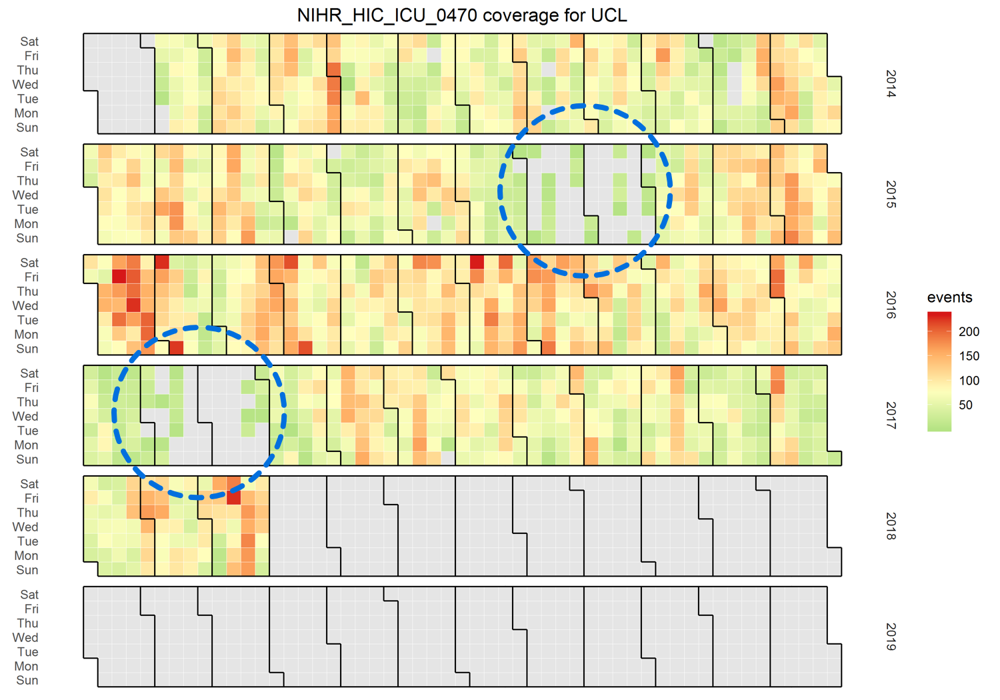
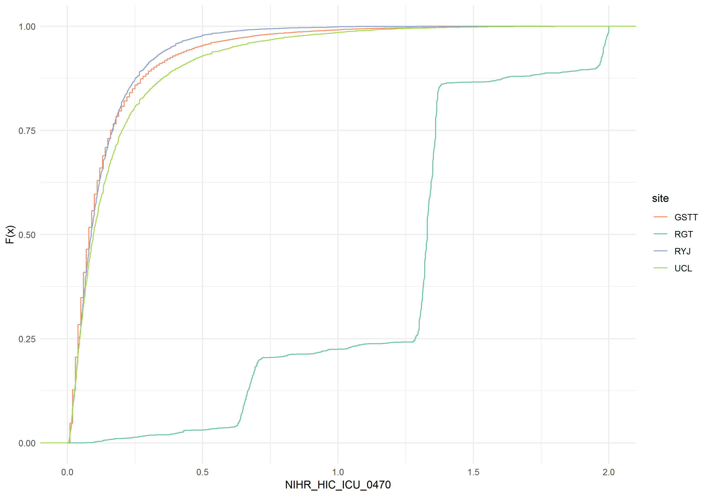

# Example

```{r exemplar_coverage, echo = FALSE}

```

The coverage plots show when an event is contributed to the CC-HIC database. In the example, we see that there are large deficiencies of the value during the highlighted regions. In addition, no data is contributed after March 2018. These plots are best reviewed in concert with the admission heat-maps to see if areas are deficient for episodic or other reasons.

```{r exemplar_ks, echo = FALSE}
knitr::include_graphics("./_bookdown_files/exemplar_ks.png")
```

These plots show the pairwise Kolmogorov-Smirnov distance for any continuous event. This takes a value from 0 to 1, with values close to 0 (purple) suggesting that the distribution of events is very similar. Values close to 1 (yellow) imply that the distributions of events differ substantially. In the example, we see that Oxford and Cambridge are very different to everyone else, and indeed quite different from one another. This should prompt for this event to be interrogated more closely. In many cases, this occurs due to the use of non standard units.

```{r exemplar_ecdf, echo = FALSE}

```

These plots show the empirical cumulative distribution function plot for any continuous event. These are similar to a density plot, but allow for clearer delineation between sites. In this example, you can see that Cambridge is behaving quite differently to the other sites, as the infusion (noradrenaline in this case) has been given in different units. Oxford does not appear on this plot, as the values given are outside of a range of possible values for this event.