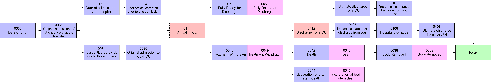

--- 
title: "CC-HIC Data Quality Reports"
author: "Dr Edward Palmer"
date: "`r Sys.Date()`"
site: bookdown::bookdown_site
documentclass: book
bibliography: [book.bib, packages.bib]
biblio-style: apalike
link-citations: yes
description: "This is a data quality report for CC-HIC"
---

```{r setup}
library(tidyverse)
load("./_bookdown_files/data/hic_event_summary.RData")
load("./_bookdown_files/data/working_data.RData")

qref <- inspectEHR:::qref

code_names <- qref %>%
  select(code_name) %>%
  pull()

names(code_names) <- qref %>%
  select(short_name) %>%
  pull()

one_d <- qref %>%
  filter(type == "1d") %>%
  select(code_name) %>%
  pull()

two_d <- qref %>%
  filter(type == "2d") %>%
  select(code_name) %>%
  pull()

all_sites <- c("UCL", "RGT", "RYJ", "OUH", "GSTT")
```

# Introduction

This report provides a comprehensive overview of the state of the CC-HIC database as of `r Sys.Date()`. The purpose of this report is to provide:

1. The starting point for any research conducted within CC-HIC. Researchers can view a comprehensive overview of the variables they are interested in.
2. A description as to the distribution and temporal patterns of data provided to CC-HIC.
3. A reference table within the CC-HIC database of pre-validated episodes and events that can be used in a research capacity - thus standardising the process of quality control for research conducted within the HIC.
4. A complement to the CC-HIC GitHub issue tracker, where researchers can report data quality issues, and sites can issue fixes.
  
## Nomencleature

A brief description of specific terms used in the report are outlined:

- **Event**: The base unit of information in the CC-HIC database. Any individual piece of information that is recorded in CC-HIC, this often (but not always) includes a value, date-time metadata and a reference to the patient it came from.
- **Episode**: An ICU "Episode" defined by a patient with a start point (admission date time) and and end point, that could be one of:
  - Discharge
  - Death, Brain-stem Death or Body Removal
  - Declaration that episode is not yet closed
- **Spell**: a continuous period of patient care under one intensive care provider; spells are the aggregation of one or more episodes. Spells are a derived field that are calculated based upon a patient being discharged from one unit within a provider, and being admitted to a different unit within the same provider within a defined time period (usually one hour). Outside this definition, any discharge and re-admission would count as the beginning of a new episode and new spell.

## Overview

Version 1.0 for CC-HIC contains 255 data fields. These fields have been sub-classified according to their importance: mandatory and optional. Optional fields have been regrouped into "bundles". The reason for this, is that data quality usually effects particular fields en masse, and so it is useful to consider them together. For example, if there is an issue with PaO~2~ results, it is commonplace to see errors in all point-of-care testing.

### Mandatory Fields

Mandatory fields that are essential for characterising the ICU episode and include:

1. A unique patient identifier - 'NIHR_HIC_ICU_0073'; "NHS Number"
2. An episode start date-time - 'NIHR_HIC_ICU_0411'; "Date & Time of admission to your unit"
3. An episode end date-time, which could be any from (in order of preference):
  - 'NIHR_HIC_ICU_0412': "Date & Time of discharge from your unit"
  - 'NIHR_HIC_ICU_0042' AND 'NIHR_HIC_ICU_0043': Date and Time of death on ICU
  - 'NIHR_HIC_ICU_0044' AND 'NIHR_HIC_ICU_0045': Date and Time of brain stem death on ICU
  - 'NIHR_HIC_ICU_0038' AND 'NIHR_HIC_ICU_0039': Date and Time body removed from ICU
  
*Note: some date-time instances are stored separately as date and time objects. Coincident date-time pairs are useless and should be avoided. A future specification should combine these elements*

An overview of the time cascade, based upon the ICNARC methodology can be seen below:

```{r datetime_cascade, echo=FALSE}

```
